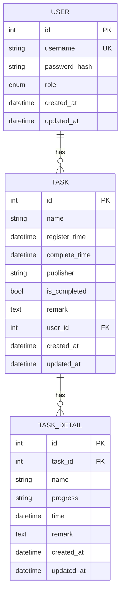

# 后端设计文档

> 项目路径：E:\ai\claude code\代码开发\需求开发事项统计
> 生成日期：2026-05-28
> 状态：DRAFT

---

## 一、技术架构

### 1.1 技术栈

| 层级 | 技术选型 | 说明 |
|------|----------|------|
| 框架 | FastAPI 0.115+ | 高性能异步 API |
| 数据库 | MySQL 8.0 / SQLAlchemy 2.0 | ORM + 异步支持 |
| 认证 | JWT (python-jose) | Token 认证 |
| 密码 | bcrypt | 密码哈希 |
| 验证 | Pydantic v2 | 数据校验 |
| CORS | FastAPI CORS Middleware | 跨域配置 |

### 1.2 项目结构

```
backend/
├── app/
│   ├── __init__.py
│   ├── main.py              # 应用入口
│   ├── config.py            # 配置管理
│   ├── database.py          # 数据库连接
│   ├── api/
│   │   ├── __init__.py
│   │   ├── deps.py          # 依赖注入
│   │   └── routes/
│   │       ├── __init__.py
│   │       ├── auth.py      # 认证路由
│   │       └── tasks.py     # 任务路由
│   ├── models/
│   │   ├── __init__.py
│   │   ├── user.py          # 用户模型
│   │   └── task.py          # 任务模型
│   ├── schemas/
│   │   ├── __init__.py
│   │   ├── user.py          # 用户 Pydantic 模型
│   │   ├── task.py          # 任务 Pydantic 模型
│   │   └── response.py      # 统一响应模型
│   ├── services/
│   │   ├── __init__.py
│   │   ├── auth.py          # 认证服务
│   │   └── task.py          # 任务服务
│   └── core/
│       ├── __init__.py
│       ├── security.py      # 安全工具（JWT、密码）
│       └── config.py       # 配置模型
├── tests/
│   ├── __init__.py
│   ├── conftest.py         # pytest fixtures
│   ├── test_auth.py
│   └── test_tasks.py
├── requirements.txt
└── README.md
```

---

## 二、数据库设计

### 2.1 ER 图



### 2.2 表设计

#### 用户表（sys_user）

| 字段 | 类型 | 约束 | 说明 |
|------|------|------|------|
| id | INT | PRIMARY KEY, AUTO_INCREMENT | 主键 |
| username | VARCHAR(50) | UNIQUE, NOT NULL | 用户名 |
| password_hash | VARCHAR(255) | NOT NULL | 密码哈希（bcrypt） |
| role | ENUM('admin', 'user') | NOT NULL, DEFAULT 'user' | 角色 |
| created_at | DATETIME | NOT NULL, DEFAULT CURRENT_TIMESTAMP | 创建时间 |
| updated_at | DATETIME | NOT NULL, ON UPDATE CURRENT_TIMESTAMP | 更新时间 |

#### 任务表（sys_task）

| 字段 | 类型 | 约束 | 说明 |
|------|------|------|------|
| id | INT | PRIMARY KEY, AUTO_INCREMENT | 主键 |
| name | VARCHAR(200) | NOT NULL | 任务名称 |
| register_time | DATETIME | NOT NULL | 登记时间 |
| complete_time | DATETIME | NULL | 完成时间 |
| publisher | VARCHAR(50) | NOT NULL | 发布人 |
| is_completed | BOOLEAN | NOT NULL, DEFAULT FALSE | 是否完成 |
| remark | TEXT | NULL | 备注 |
| user_id | INT | NOT NULL, FOREIGN KEY | 所属用户 |
| created_at | DATETIME | NOT NULL, DEFAULT CURRENT_TIMESTAMP | 创建时间 |
| updated_at | DATETIME | NOT NULL, ON UPDATE CURRENT_TIMESTAMP | 更新时间 |

#### 任务明细表（sys_task_detail）

| 字段 | 类型 | 约束 | 说明 |
|------|------|------|------|
| id | INT | PRIMARY KEY, AUTO_INCREMENT | 主键 |
| task_id | INT | NOT NULL, FOREIGN KEY | 所属任务 |
| name | VARCHAR(200) | NOT NULL | 明细名称 |
| progress | VARCHAR(50) | NULL | 进度 |
| time | DATETIME | NULL | 时间 |
| remark | TEXT | NULL | 备注 |
| created_at | DATETIME | NOT NULL, DEFAULT CURRENT_TIMESTAMP | 创建时间 |
| updated_at | DATETIME | NOT NULL, ON UPDATE CURRENT_TIMESTAMP | 更新时间 |

---

## 三、API 设计

### 3.1 认证接口

#### 登录
- **POST** `/api/auth/login`
- **Body:** `{ "username": string, "password": string }`
- **Response:** `{ "access_token": string, "token_type": "bearer", "user": { "id": int, "username": string, "role": string } }`

#### 刷新 Token
- **POST** `/api/auth/refresh`
- **Headers:** `Authorization: Bearer <token>`
- **Response:** `{ "access_token": string, "token_type": "bearer" }`

### 3.2 任务接口

#### 获取任务列表
- **GET** `/api/tasks`
- **Query:** `is_completed?: boolean`, `page?: int`, `page_size?: int`
- **Response:**
```json
{
  "items": [Task],
  "total": int,
  "page": int,
  "page_size": int,
  "pages": int
}
```

#### 获取单个任务
- **GET** `/api/tasks/{id}`
- **Response:** `Task`

#### 创建任务
- **POST** `/api/tasks`
- **Body:** `{ "name": string, "register_time": datetime, "publisher": string, "remark": string? }`
- **Response:** `Task`

#### 更新任务
- **PUT** `/api/tasks/{id}`
- **Body:** `{ "name": string?, "register_time": datetime?, "publisher": string?, "remark": string? }`
- **Response:** `Task`

#### 删除任务
- **DELETE** `/api/tasks/{id}`
- **Response:** `{ "message": "Task deleted" }`

#### 标记完成
- **POST** `/api/tasks/{id}/complete`
- **Response:** `Task` (with `is_completed: true`, `complete_time`)

#### 顺延到明天
- **POST** `/api/tasks/{id}/defer`
- **Logic:** 原任务标记完成，创建新任务（register_time = 明天）
- **Response:** `{ "original": Task, "deferred": Task }`

### 3.3 任务明细接口

#### 获取明细列表
- **GET** `/api/tasks/{task_id}/details`
- **Response:** `[TaskDetail]`

#### 添加明细
- **POST** `/api/tasks/{task_id}/details`
- **Body:** `{ "name": string, "progress": string?, "time": datetime?, "remark": string? }`
- **Response:** `TaskDetail`

#### 更新明细
- **PUT** `/api/tasks/{task_id}/details/{id}`
- **Body:** `{ "name": string?, "progress": string?, "time": datetime?, "remark": string? }`
- **Response:** `TaskDetail`

#### 删除明细
- **DELETE** `/api/tasks/{task_id}/details/{id}`
- **Response:** `{ "message": "TaskDetail deleted" }`

---

## 四、数据模型

### 4.1 Pydantic Schemas

```python
# 统一响应
class BaseResponse(BaseModel):
    code: int = 200
    message: str = "Success"
    data: Any = None

# 用户
class UserCreate(BaseModel):
    username: str = Field(..., min_length=3, max_length=50)
    password: str = Field(..., min_length=6)
    role: UserRole = UserRole.user

class UserLogin(BaseModel):
    username: str
    password: str

class UserResponse(BaseModel):
    id: int
    username: str
    role: UserRole

class Token(BaseModel):
    access_token: str
    token_type: str = "bearer"

class LoginResponse(Token):
    user: UserResponse

# 任务
class TaskCreate(BaseModel):
    name: str = Field(..., min_length=1, max_length=200)
    register_time: datetime
    publisher: str = Field(..., max_length=50)
    remark: str | None = None

class TaskUpdate(BaseModel):
    name: str | None = None
    register_time: datetime | None = None
    publisher: str | None = None
    remark: str | None = None

class TaskResponse(BaseModel):
    id: int
    name: str
    register_time: datetime
    complete_time: datetime | None
    publisher: str
    is_completed: bool
    remark: str | None
    user_id: int
    created_at: datetime
    updated_at: datetime

class TaskListResponse(BaseModel):
    items: list[TaskResponse]
    total: int
    page: int
    page_size: int
    pages: int

# 任务明细
class TaskDetailCreate(BaseModel):
    name: str = Field(..., min_length=1, max_length=200)
    progress: str | None = None
    time: datetime | None = None
    remark: str | None = None

class TaskDetailUpdate(BaseModel):
    name: str | None = None
    progress: str | None = None
    time: datetime | None = None
    remark: str | None = None

class TaskDetailResponse(BaseModel):
    id: int
    task_id: int
    name: str
    progress: str | None
    time: datetime | None
    remark: str | None
    created_at: datetime
    updated_at: datetime
```

---

## 五、安全设计

### 5.1 JWT 配置

| 配置项 | 值 | 说明 |
|--------|-----|------|
| 算法 | HS256 | HMAC + SHA256 |
| 过期时间 | 24h | access_token |
| 刷新间隔 | 7d | refresh_token |

### 5.2 密码安全

- 使用 bcrypt 哈希（salt + cost factor 12）
- 禁止明文存储
- 登录失败锁定（预留）

### 5.3 API 安全

- 所有 `/api/*` 接口需要 Bearer Token
- 密码字段在响应中返回
- SQL 注入防护（使用 ORM）
- CORS 配置只允许前端地址

---

## 六、依赖

```
fastapi>=0.115.0
uvicorn[standard]>=0.30.0
sqlalchemy>=2.0.0
aiomysql>=0.2.0
pydantic>=2.0.0
python-jose[cryptography]>=3.3.0
passlib[bcrypt]>=1.7.0
python-multipart>=0.0.9
```

---

## 七、待开发

- [x] 后端项目初始化（FastAPI + 目录结构）
- [x] 数据库建表 SQL
- [x] 用户认证 API
- [x] 任务 CRUD API
- [x] 任务明细 API
- [ ] 单元测试

---

## 设计文档

生成时间：2026-05-28